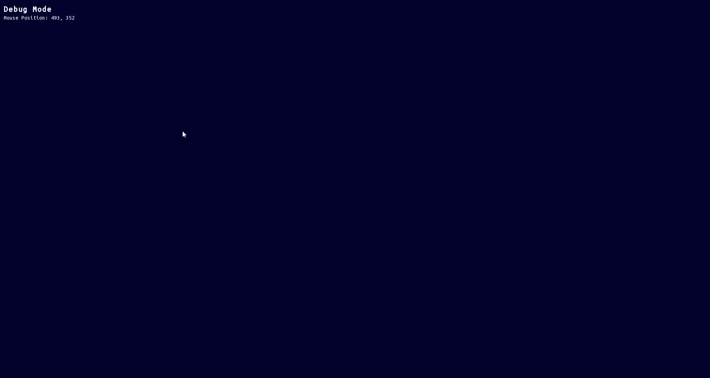

# Hydrae Project
### Markus Schüller Perdigón
### Made with SFML VSCode Boilerplate

# What is this?
* A game engine based around gravity and collisions.
* To add more physics dynamics in the future.
* Base for a hypothetical game.
* A project done for fun and for learning purposes!

# Status
* Implemented gravity, trails for the objects and a debug mode with selectable objects.

### Example of an execution of the debug mode:

# To do
* Add a menu with buttons to customize parameters
* Add the ability to create an object with initial speed and direction
* Improve performance.
* Re-organize some bits of code, especially `Main.cpp`
  * Keep in mind that right now each "world" would be a different "main file", but the idea is to let the main file select different worlds.

# Known bugs
* Some bits of the trails stay too bright at the initial spot and disappear when the body moves enough.